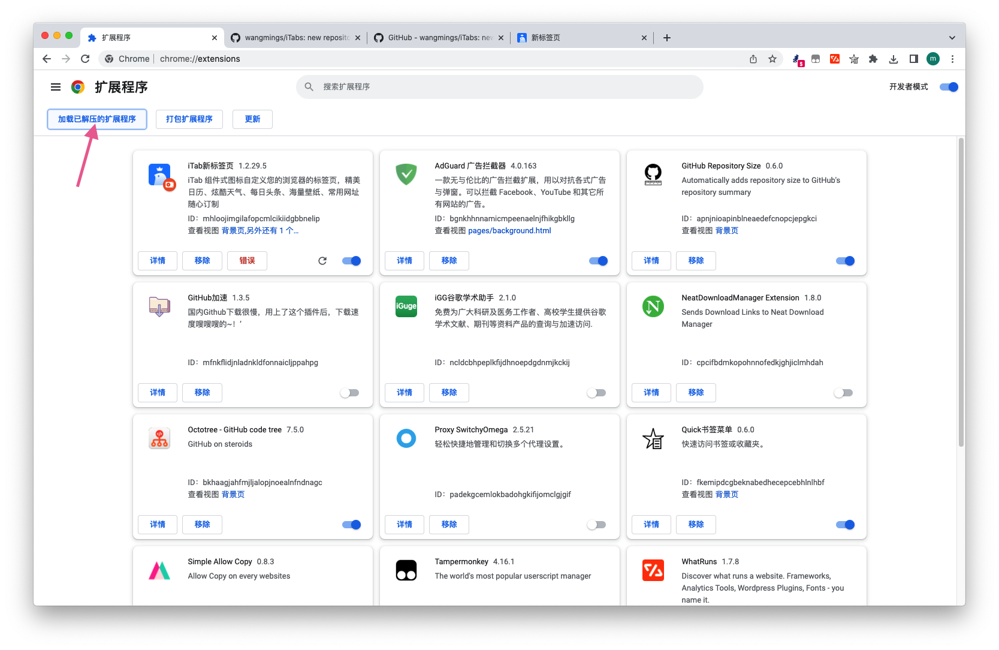

# iTab谷歌游览器插件

## 原iTab新标签页修改版

> #### 功能说明:

1. ##### 修改了页面布局排版、让它更加好看实用

> #### 代码修改:

```js
# 添加代码位置
目录: ./dist/imgs 
download.py 下载离线图标
目录: ./dist/js
main.js 修改

```


> #### 使用说明

1. ###### 下载项目、打开谷歌游览器、找到扩展插件、添加项目

   

2. ###### 打开标签页找到设置导入.itabdata备份文件、完成

   

   
